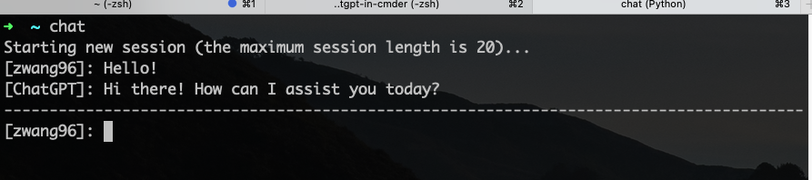

## ChatGPT in command line

OpenAI API bot in command line

1. `pip install openai`
2. Get OPENAI_API_KEY from https://platform.openai.com/account/api-keys
3. Set environment variable OPENAI_API_KEY
4. [Optional] In shell, `alias chat="OPENAI_API_KEY=$OPENAI_API_KEY python <SOME_PATH>/chat.py"`

